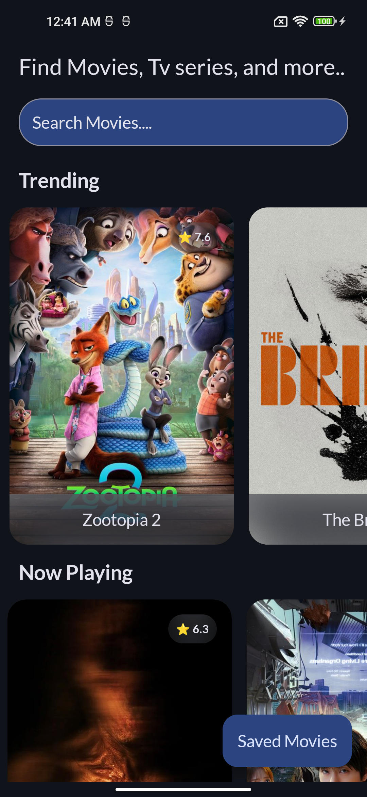
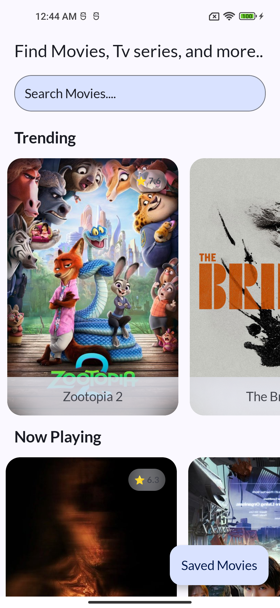
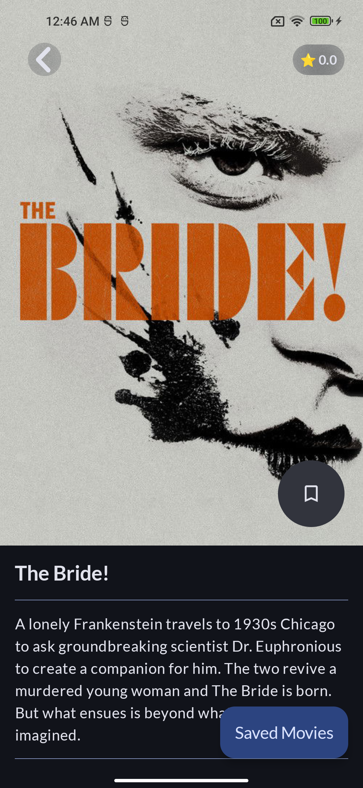
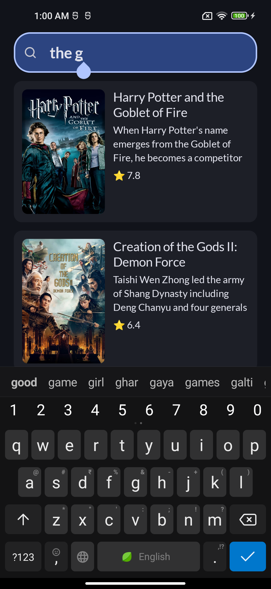
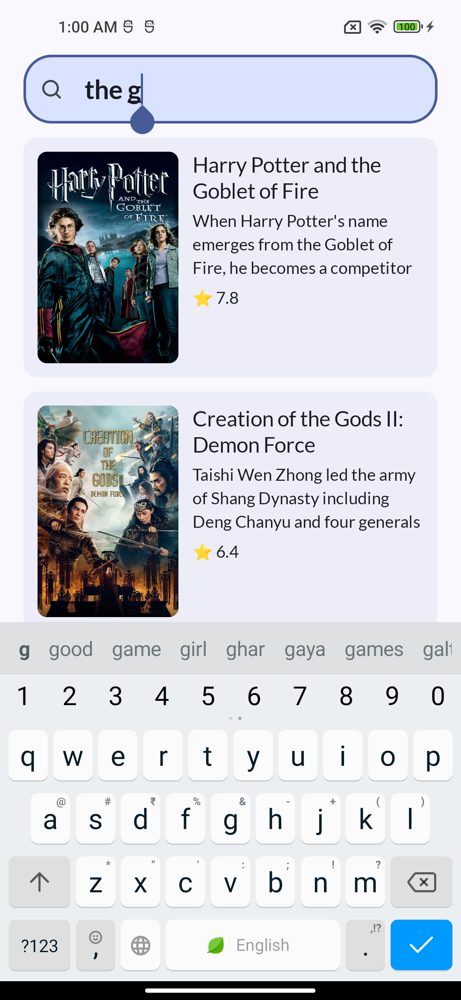
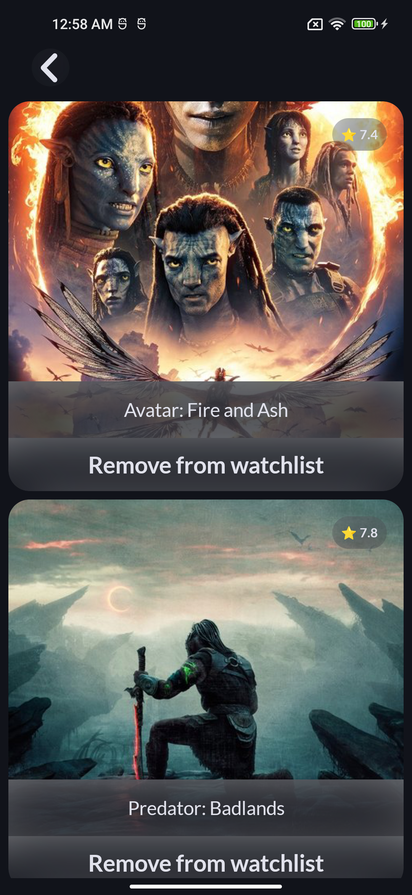
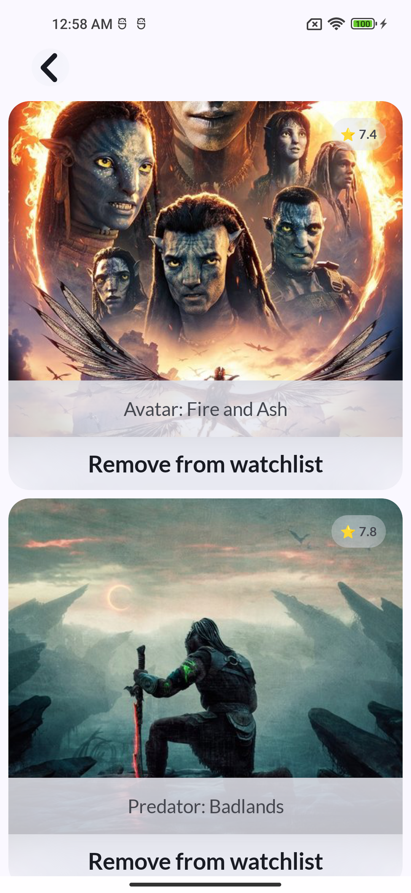

# 🎬 TMDB an movies Database App

An Android application built with **Kotlin**, **Jetpack Compose**, **Retrofit**, and **Room** using the [TMDB API](https://developers.themoviedb.org/3/getting-started/introduction).  
The app shows trending and now playing movies, lets users search, bookmark, and view movie details — with offline support.

---

## 🚀 Features
- Home screen with **Trending** and **Now Playing** movies
- **Movie Details** page with poster, overview, release date, and bookmark toggle
- **Bookmarking** support with a Saved Movies page
- **Offline-first** architecture using Room
- **Search** with debounce (results update as you type)
- Clean **MVVM + Repository** architecture
- Coroutines + Flow for async DB/network calls

---

## 🛠️ Tech Stack
- **Language:** Kotlin
- **UI:** Jetpack Compose, Material 3
- **Networking:** Retrofit + OkHttp + Gson
- **Database:** Room ORM
- **Architecture:** MVVM + Repository Pattern
- **Async:** Coroutines + Flow
- **Dependency Injection:** Hilt

---

## 🔑 API Key Setup
This project uses the TMDB API which requires an API key.

1. Get your API key from [TMDB](https://developers.themoviedb.org/3/getting-started/introduction).
2. Open your project’s `local.properties` file (located at the root of your project).
3. Add the following line:

   ```properties
   TMDB_API_KEY=your_api_key_here

# 📱 Screenshots

<p align="center">
  
  
  <br/>
  <b>Home Screen — Dark / Light</b>
</p>

<p align="center">
  
  
  <br/>
  <b>Details Screen — Dark / Light</b>
</p>

<p align="center">
  
  
  <br/>
  <b>Search Screen — Dark / Light</b>
</p>

<p align="center">
  
  
  <br/>
  <b>Saved Screen — Dark / Light</b>
</p>


